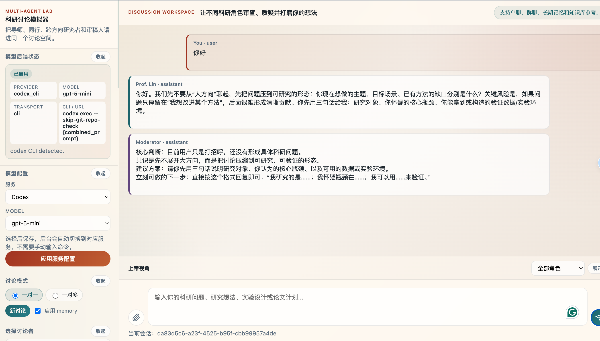

# Research Discussion Simulator

[中文说明](README.zh-CN.md)



Research Discussion Simulator is a local web app for people who want to think through research ideas with several AI collaborators. You can start with a rough question, invite different roles into the discussion, upload notes or papers as context, and use the conversation to clarify your research problem, method, experiments, and risks.

The app starts from a clean state. It includes only the built-in roles and empty example data, so your conversations, memories, profile, uploaded files, and model settings stay local unless you choose to share them.

## What You Can Do

- Discuss one-on-one with a single research role
- Run a group discussion with multiple roles
- Ask an advisor-style role to sharpen the research question
- Ask a peer researcher to check method details, baselines, and ablations
- Ask a cross-domain researcher to suggest reframing and transfer ideas
- Ask a skeptical reviewer to point out weak assumptions and failure modes
- Turn long-term memory on or off for each discussion
- Edit your own profile card as the discussion evolves
- Create, edit, and delete custom roles
- Upload notes, papers, drafts, or other reference files as a local knowledge base
- Attach files to a specific discussion turn
- Stream model responses in the browser
- Assign different model backends to different roles

## Quick Start

```bash
python3 -m venv .venv
source .venv/bin/activate
pip install -r requirements.txt
uvicorn app.main:app --reload
```

Then open:

```text
http://127.0.0.1:8000
```

Python 3.9+ is recommended.

## Choose a Model Backend

After the app starts, use the model settings panel in the left sidebar to choose a provider and model.

You can also create a local `llm_config.json` file:

```bash
cp llm_config.example.json llm_config.json
```

`llm_config.json` is ignored by Git, so your API keys and local commands are not committed by default.

OpenAI or OpenAI-compatible API:

```json
{
  "provider": "openai_compatible",
  "api_key": "your_api_key",
  "model": "gpt-4o-mini",
  "base_url": "https://api.openai.com/v1"
}
```

Local vLLM or Ollama-compatible endpoint:

```json
{
  "provider": "openai_compatible",
  "api_key": "dummy",
  "model": "Qwen2.5-7B-Instruct",
  "base_url": "http://127.0.0.1:8000/v1"
}
```

Codex CLI:

```json
{
  "service": "codex",
  "provider": "codex_cli",
  "model": "gpt-5.4",
  "cli_timeout_seconds": 180,
  "cli_command": ["codex", "exec", "--skip-git-repo-check", "{combined_prompt}"]
}
```

Claude CLI:

```json
{
  "service": "claude",
  "provider": "claude_cli",
  "model": "claude-sonnet",
  "cli_timeout_seconds": 180,
  "cli_command": ["claude", "-p", "{combined_prompt}"]
}
```

If you do not configure a model, the app can still run in mock mode so you can try the interface and discussion flow.

## Built-in Roles

- `advisor`: helps define the research question, contribution, and experiment plan
- `peer_ml`: checks technical details, baselines, fairness, and ablations
- `cross_domain`: brings ideas from other fields and reframes the problem
- `skeptic`: looks for weak assumptions, failure modes, and reviewer objections

You can also create your own roles from the left sidebar.

## Upload Files

Supported formats:

```text
.txt .md .pdf .docx .doc
```

Use the knowledge base for material that should be reusable across turns. Use conversation attachments for files that only matter to the current question.

## Privacy Notes

Runtime data is stored under `app/data/` on your machine. The public starter data includes only:

- empty role memory files
- an empty knowledge index
- a generic user profile
- an empty example conversation

Generated conversations, local uploads, local model settings, virtual environments, and Python cache files are ignored by Git.

## Feedback and Contributions

Issues and pull requests are welcome. Useful feedback includes:

- which research workflows feel useful or confusing
- what role presets you want
- where the discussion orchestration breaks down
- how memory and knowledge retrieval should behave
- what model providers should be supported next
- frontend usability problems
- bugs, tests, and documentation fixes

Please do not include private API keys, private conversations, local memory files, or private uploaded documents in issues or pull requests.

## Project Layout

```text
research-discussion-simulator/
├── app/
│   ├── main.py
│   ├── agents.py
│   ├── knowledge.py
│   ├── llm.py
│   ├── models.py
│   ├── orchestrator.py
│   ├── storage.py
│   ├── config.py
│   ├── data/
│   └── static/
├── requirements.txt
├── environment.yml
├── llm_config.example.json
├── README.md
└── README.zh-CN.md
```
